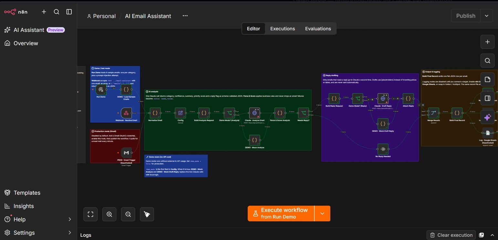
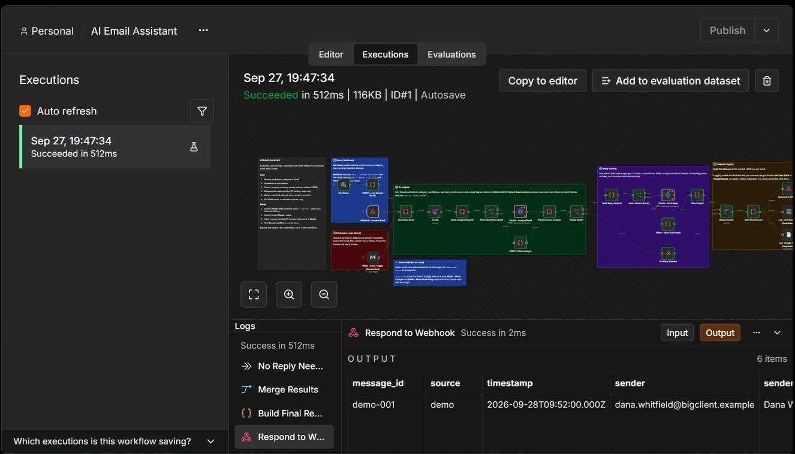
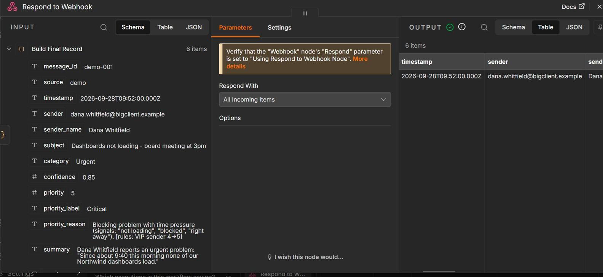

# AI Email Assistant (n8n + Claude)

An n8n workflow that triages a business inbox. For every incoming email it:

1. extracts sender, subject, body and timestamp
2. classifies it as **Urgent**, **Sales / Lead**, **Support**, **Meeting / Scheduling**, **General** or **Spam / Low Priority**
3. writes a one-to-two sentence summary
4. assigns a 1–5 priority score, adjusted by explicit business rules
5. drafts a professional reply for a person to review (never sent automatically)
6. outputs one flat JSON record that is ready for Google Sheets, Notion, an n8n Data Table or a CRM

You can test it in about two minutes with built-in sample emails, no Gmail needed. **Demo mode** (on by default) runs the whole pipeline with zero API usage. Set `demo_mode = false` to use Claude, and enable one node to switch to live Gmail.

---

## Architecture

```mermaid
flowchart LR
    subgraph IN["Input (choose a mode)"]
        A1["Run Demo<br/>(Manual Trigger)"] --> A2["DEMO · Load Sample Emails"]
        B1["Webhook · Receive Email<br/>POST /email-assistant"]
        C1["PROD · Gmail Trigger<br/>(disabled by default)"]
    end

    A2 --> N["Normalize Email"]
    B1 --> N
    C1 --> N
    N --> CFG["Config<br/>demo_mode · model · prompts · VIP domains"]
    CFG --> BA["Build Analysis Request"] --> DA{"Demo Mode?<br/>(Analyze)"}
    DA -- "false" --> CA["Claude · Analyze Email<br/>category · summary · priority"]
    DA -- "true" --> MA["DEMO · Mock Analyze<br/>(no API call)"]
    CA --> PS["Parse & Score Analysis<br/>validation + business rules"]
    MA --> PS
    PS --> Q{"Needs Reply?"}
    Q -- yes --> BR["Build Reply Request"] --> DR{"Demo Mode?<br/>(Reply)"}
    DR -- "false" --> CR["Claude · Draft Reply"] --> AR["Attach Reply"]
    DR -- "true" --> MR["DEMO · Mock Draft Reply<br/>(no API call)"] --> AR
    Q -- no --> NR["No Reply Needed"]
    AR --> M["Merge Results"]
    NR --> M
    M --> F["Build Final Record<br/>flat JSON"]
    F --> R["Respond to Webhook"]
    F --> L1["Log · n8n Data Table<br/>(disabled)"]
    F --> L2["Log · Google Sheets<br/>(disabled)"]
```



| Stage | Nodes | What happens |
|---|---|---|
| Input | Run Demo, Webhook, Gmail Trigger | Three entry points. Each is clearly labelled as demo, test or production. |
| Normalize | Normalize Email | Demo items, webhook payloads (single, array or `{emails: []}`) and both Gmail output formats all become one schema. |
| Config | Config | Model, effort levels, token limits, company context, signature, VIP domains and both system prompts. Everything you would tune lives in this one node. |
| Analysis | Build Analysis Request → Claude · Analyze Email → Parse & Score Analysis | A single Claude call returns category, confidence, summary, priority and a reply flag. **Structured outputs** guarantee the response matches a JSON schema. |
| Rules | Parse & Score Analysis | Deterministic rules run on top of the model's score: Urgent is at least 4, VIP domains get +1, spam is capped at 1. Every adjustment is written into the record. |
| Reply | Needs Reply? → Build Reply Request → Claude · Draft Reply → Attach Reply | Only emails that need an answer get a second call, so spam and FYIs cost nothing extra. |
| Output | Merge Results → Build Final Record → Respond / Log | One flat, fixed-order record per email. |
| Demo mode | Demo Mode? (Analyze / Reply) → DEMO · Mock Analyze / Mock Draft Reply | When `demo_mode` is true, local mock nodes return responses in the exact Claude API shape, so every other node runs unchanged with no API usage. |

### Design decisions

- **Two LLM calls instead of four.** Classification, summary and priority all come from reading the same email, so one call handles them. It is cheaper, faster and gives consistent results. Reply drafting is a separate call because it needs the analysis as input and is skipped for spam.
- **Structured outputs over prompt-and-pray.** The analysis and reply calls use `output_config.format` with a JSON schema, so the Code nodes parse guaranteed JSON instead of scraping free text.
- **Hybrid priority scoring.** The model judges urgency from the content, and code applies the rules a business actually has (VIP accounts, spam). The final score is explainable, for example `[rules: urgent floor 3→4, VIP sender 4→5]`.
- **Emails are never lost.** API errors, refusals, timeouts and invalid output produce a record with `status: "needs_review"` instead of a failed execution. HTTP nodes retry transient errors three times first.
- **Prompt-injection aware.** Email content is wrapped in `<email>` tags and both prompts treat it as untrusted data. Sample email #6 attempts an injection to demonstrate this.
- **Human in the loop.** Replies are drafts. The prompt tells the model to insert `[placeholders]` instead of inventing prices, dates or policies.
- **No secrets in files.** The API key lives in an n8n credential. The workflow JSON contains no credential references, and a test checks this.
- **Zero-cost demo mode as a parallel path.** Two IF routers send items either to the untouched Claude nodes or to local mock nodes. The mocks use keyword heuristics and reply templates built from the email, and they label every record `model: "demo-mock"`, so demo output can't be mistaken for real AI output.

---

## Project structure

```
n8n-email-assistant/
├── workflows/ai-email-assistant.json   ← import this into n8n
├── code/                               ← JavaScript for each Code node (readable source)
│   ├── normalize-email.js
│   ├── build-analysis-request.js
│   ├── parse-and-score.js
│   ├── build-reply-request.js
│   ├── attach-reply.js
│   ├── build-final-record.js
│   ├── mock-analyze.js                 ← demo mode: local stand-in for Claude · Analyze Email
│   └── mock-draft-reply.js             ← demo mode: local stand-in for Claude · Draft Reply
├── prompts/
│   ├── analysis-system.md              ← classification + summary + priority prompt
│   ├── reply-system.md                 ← reply drafting prompt
│   └── README.md                       ← prompt design notes
├── test-data/
│   ├── sample-emails.json              ← 6 demo emails, one per category
│   ├── webhook-single-email.json
│   └── webhook-batch.json
├── scripts/
│   ├── build-workflow.js               ← regenerates the workflow JSON from code/ + prompts/
│   └── test-pipeline.js                ← offline tests with mocked Claude responses
├── docs/
│   ├── SETUP.md                        ← step-by-step setup, all three modes
│   ├── PORTFOLIO.md                    ← case study + platform descriptions
│   └── SCREENSHOTS.md                  ← what to capture for Contra, Upwork, LinkedIn, GitHub
├── .env.example
└── package.json
```

`workflows/ai-email-assistant.json` is generated from `code/`, `prompts/` and `test-data/`. Edit those files, then run `npm run build`. For quick experiments you can also edit directly in n8n.

---

## Quick start

Full instructions: **[docs/SETUP.md](docs/SETUP.md)**

1. Open n8n at `http://localhost:5679`.
2. Create a workflow, open the **⋯** menu, choose **Import from File**, and select `workflows/ai-email-assistant.json`.
3. Click **Execute workflow**. Six sample emails run through the pipeline in demo mode, with no API key needed. Open **Build Final Record** to see the results.
4. To use real AI, create a **Header Auth** credential (name: `x-api-key`, value: your Anthropic API key), select it in **Claude · Analyze Email** and **Claude · Draft Reply**, and set `demo_mode` to `false` in **Config**.

### Modes

Two independent switches: **where emails come from** (trigger) and **who analyzes them** (`demo_mode`).

| `demo_mode` | Analysis and replies by | API usage | Needs |
|---|---|---|---|
| `true` (default) | DEMO · Mock Analyze / Mock Draft Reply | None | Nothing |
| `false` | Claude · Analyze Email / Draft Reply | Anthropic API | Anthropic credential |

| Trigger | Use it for | Needs |
|---|---|---|
| Run Demo (Manual Trigger) | Portfolio demos and prompt tuning with the six sample emails | Nothing extra |
| Webhook · Receive Email | Sending your own emails via curl, Postman, or another system (Zapier, Make, an email-parsing service) | Nothing extra |
| PROD · Gmail Trigger | Live inbox triage every minute (use with `demo_mode = false`) | Gmail OAuth2 credential, node enabled, workflow published |

Test the webhook (after clicking **Execute workflow** so the test URL is listening):

```bash
curl -X POST http://localhost:5679/webhook-test/email-assistant -H "Content-Type: application/json" -d @test-data/webhook-single-email.json
```

---

## Output

Each email produces one record with the same fields in the same order:

```json
{
  "message_id": "demo-002",
  "source": "demo",
  "timestamp": "2026-09-28T10:15:00.000Z",
  "sender": "marco.rossi@freshcart.example",
  "sender_name": "Marco Rossi",
  "subject": "Pricing for 40 seats + SSO?",
  "category": "Sales / Lead",
  "confidence": 0.95,
  "priority": 4,
  "priority_label": "High",
  "priority_reason": "Qualified prospect with a 31 October renewal deadline asking for pricing and a demo.",
  "summary": "Marco Rossi (Head of Data, FreshCart) wants pricing for ~40 seats, confirmation of Okta SSO and a Snowflake connector, and a demo next week before their 31 Oct renewal.",
  "requires_reply": true,
  "suggested_reply": "Hi Marco,\n\nThank you for considering Northwind Analytics...\n\n[confirm price for 40 seats on the Business plan]...\n\nAlex Morgan\nCustomer Success, Northwind Analytics",
  "reply_status": "drafted",
  "status": "ok",
  "notes": "",
  "model": "configurable-claude-model",
  "processed_at": "2026-09-28T10:15:07.412Z"
}
```

*The analysis text above is illustrative. Your results depend on the model and prompts. In demo mode, `model` is `"demo-mock"` and the text comes from the mock nodes.*

| Field | Meaning |
|---|---|
| `category` | One of the six categories (enforced by the JSON schema) |
| `priority` / `priority_label` | 1 Minimal · 2 Low · 3 Medium · 4 High · 5 Critical, after business rules |
| `priority_reason` | The model's reason plus any rule adjustments, e.g. `[rules: VIP sender 3→4]` |
| `reply_status` | `drafted`, `skipped` (no reply needed) or `failed` |
| `status` | `ok`, or `needs_review` when any step failed (details in `notes`) |

### Logging destinations

The record is flat and scalar, so it maps 1:1 onto:

- **n8n Data Table** (built in, no external account). Enable **Log · n8n Data Table**.
- **Google Sheets**. Enable **Log · Google Sheets**. The column list is in [SETUP.md](docs/SETUP.md#6-logging).
- **Notion / Airtable / HubSpot / Pipedrive**. Replace a log node with the matching n8n node and map the same fields.

---

## Testing

```bash
npm test
```

This runs 23 offline checks: workflow wiring (including both demo-mode routers), embedded code matching `code/*.js`, no secrets in the JSON, normalization of every input format, scoring rules, every failure path, and the demo-mode mock outputs. No API key or n8n instance is needed. No local Node.js? See [SETUP.md](docs/SETUP.md#rebuilding-and-testing-without-local-nodejs).

The workflow has also been imported and executed in n8n 2.37.10 in both modes. With `demo_mode = true` it runs end to end with networking disabled, and the Claude nodes never execute.

---

## Configuration

All settings are fields in the **Config** node:

| Field | Default | Notes |
|---|---|---|
| `demo_mode` | `true` | `true`: local mock nodes, no API usage. `false`: Claude API (production) |
| `model` | `claude-opus-5` | Any Claude model that supports structured outputs |
| `analysis_effort` / `reply_effort` | `low` / `medium` | Classification needs little reasoning; replies benefit from more |
| `analysis_max_tokens` / `reply_max_tokens` | `4000` / `6000` | Includes the model's internal reasoning tokens |
| `max_body_chars` | `20000` | Longer bodies are truncated for analysis and flagged in `notes` |
| `use_refusal_fallback` | `true` | If the model declines on policy grounds, the API retries on Anthropic's recommended fallback model |
| `company_name`, `company_context`, `signature` | Northwind Analytics demo values | Give Claude the context to tell sales from support |
| `vip_domains` | `bigclient.example` | Comma-separated. Senders on these domains get +1 priority |
| `analysis_system_prompt`, `reply_system_prompt` | from `prompts/` | Edit here for quick tuning, or in `prompts/` and rebuild |

---

## Roadmap

- Save drafts directly to Gmail (Gmail node → *Create draft* in the same thread)
- Apply Gmail labels per category and mark processed mail as read
- Slack or Teams alert for priority 5
- Deduplicate on `message_id` before logging (Data Table *upsert*)
- Evaluation set: a labelled inbox sample to measure category accuracy when prompts or models change

## Security notes

- Secrets are stored only in n8n credentials. `n8n-data/` (database and encryption key) is git-ignored.
- The test webhook has no authentication, which is fine on `localhost`. Before exposing n8n publicly, set the Webhook node's **Authentication** to Header Auth.
- Email content can contain personal data. It is sent to the Anthropic API for processing, so choose logging destinations and retention with that in mind.

## Tech

n8n 2.x · Claude API (Messages API, structured outputs) · JavaScript Code nodes · Docker

## Screenshots

### Workflow Overview


### Demo Execution


### Output Detail

